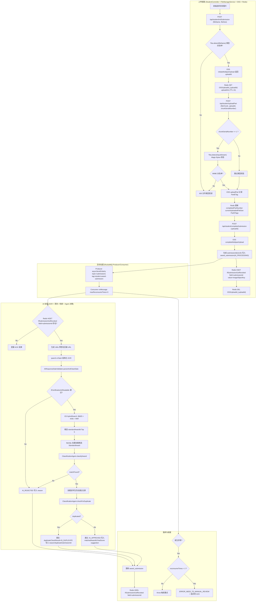
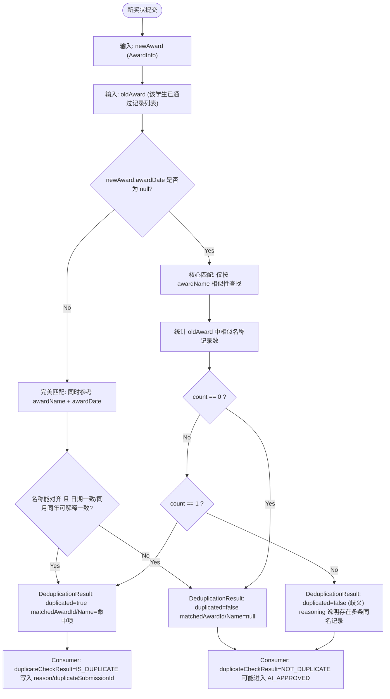

# AwardProcessor - 技术架构与实现原理

## 1. 核心技术深度解析：基于 RAG 的智能审核流水线

本项目的核心挑战在于如何让 AI 准确理解非结构化的奖状图片，并将其映射到严格的教务系统数据库中。我们没有简单地使用 "OCR + 规则匹配"，而是构建了一套完整的 **RAG (Retrieval-Augmented Generation)** 流水线。

### 1.1 问题定义
*   **输入**: 学生上传的任意角度、光线下的奖状图片。
*   **难点**:
    *   **名称不规范**: 奖状上写的是“蓝桥杯一等奖”，数据库标准名称是“第十四届蓝桥杯全国软件和信息技术专业人才大赛”。
    *   **幻觉风险**: 直接问 LLM "这是什么奖？"，它可能会编造一个不存在的奖项名称。
    *   **格式混乱**: 日期格式千奇百怪（`2023.1.1`, `二零二三年一月`, `2023-01-01`）。

### 1.2 架构实现细节



#### Phase 1: 多模态感知与鲁棒性清洗
*   **视觉编码**: 使用阿里云 DashScope 的多模态对话接口，模型为 `qwen3-vl-flash`（`OCRService.java:67-80`）。不同于传统 OCR 仅输出文字流，该模型会在“识别 + 结构化输出约束”的提示词下直接产出 JSON。
    *   *Prompt 关键点*（`OCRService.java:21-65`）：
        *   先判断图片是否为奖状/证书（`ifCertification`）。
        *   若为奖状/证书，再判断是否清晰可读（`isReadable`）。
        *   仅在“是奖状且可读”时提取 `studentName/awardName/awardDate`，缺失字段必须输出 `null`，禁止猜测。
        *   `awardDate` 必须格式化为 `YYYY-MM-DD`；缺少“日”默认补 `01`，缺少“月/日”默认补 `01-01`。
*   **防御性编程 - 日期清洗器 (`AIResponseDateValidator`)**:
    *   即使 OCR 提示词要求严格格式，模型仍可能输出 `2025-07-00`、`2000-00-00` 或 `2025-02-30` 之类的脏日期。
    *   因此在消费者侧会对日期做二次清洗：先修复常见的 `-00` 月/日，再按 `YYYY-MM-DD / YYYY-MM / YYYY` 三种形态解析，解析失败一律置 `null`（`AIResponseDateValidator.java:30-85`；调用点 `studentAwardSubmissionConsumer.java:112-139`）：
        ```java
        public static LocalDate parseAndCleanDate(String dateStr) {
            if (dateStr == null || dateStr.trim().isEmpty()) return null;
            String cleaned = dateStr.replace("-00", "-01");
            if (PATTERN_YYYY_MM_DD.matcher(cleaned).matches()) return LocalDate.parse(cleaned);
            if (PATTERN_YYYY_MM.matcher(cleaned).matches()) return LocalDate.parse(cleaned + "-01");
            if (PATTERN_YYYY.matcher(cleaned).matches()) {
                int year = Integer.parseInt(cleaned);
                if (year > (Year.now().getValue() - 5) && year <= Year.now().getValue()) return LocalDate.of(year, 1, 1);
            }
            return null;
        }
        ```
    *   这一步的目标不是“让日期尽量完整”，而是保证写入 `AwardInfo.awardDate` 的内容要么是可解析的合法日期，要么为 `null`，避免 JSON 反序列化与下游逻辑被脏值击穿。

#### Phase 2: 混合检索 (Hybrid Search) - 召回层的设计哲学
为了将非标准化的 OCR 文本映射到标准库，我们设计了 **Elasticsearch 混合检索策略**。

*   **向量检索 (Dense Vector Retrieval)**:
    *   使用 `Text-Embedding-v4` 模型将 OCR 提取的 `awardName` 转化为 768 维向量。
    *   利用 ES 的 `kNN` 搜索，捕捉语义相似性。
    *   *场景*: 学生上传的名称与标准库名称不完全一致时（简称/别称/缺少届次），向量检索用于召回语义接近的候选项。
*   **关键词检索 (Sparse Retrieval)**:
    *   使用 `BM25` 算法。
    *   *场景*: 学生上传 "第14届蓝桥杯"，BM25 能精确匹配到包含 "14届" 的标准记录。
*   **RRF (Reciprocal Rank Fusion)**:
    *   将两路召回结果进行加权融合得到排序结果，并在消费侧截断 Top 5 作为候选输入。这解决了单一向量检索可能出现的“语义相关但字面完全不同”的误召回问题。

#### Phase 3: Agent 推理 - 决策层的确定性
这里的“确定性”不是指模型输出可完全预测，而是通过“严格的输入上下文 + 严格的输出结构 + 明确的规则约束”，把 LLM 变成一个可集成、可追责的决策组件。项目在 `ClassificationAgent` 中定义了两个职责明确的 Agent 方法（`ClassificationAgent.java:15-118`）：

*   **归类 (`classifyAward`)**:
    *   输入：`AwardInfo`（OCR 结构化结果）+ `List<StandardAward>`（ES 混合检索召回的候选列表，消费侧截断 Top 5，`studentAwardSubmissionConsumer.java:171-188`）。
    *   规则：只要求对比 `awardName` 与候选 `officialName`，输出严格的 `AwardClassification` JSON，并且“字段缺失必须输出 null，不允许省略”（`ClassificationAgent.java:21-58`）。
    *   输出结构（与代码提示词一致）：
        ```json
        {
          "matchFound": true,
          "matchedAwardId": "string 或 null",
          "matchedAwardName": "string 或 null",
          "reasoning": "string"
        }
        ```

*   **查重 (`checkForDuplicate`)**:
    *   输入：新提交 `AwardInfo` + 该学生历史已通过记录（仅取 `AI_APPROVED/MANUAL_APPROVED`，`studentAwardSubmissionConsumer.java:193-199`）。
    *   规则：以 `awardDate` 是否为 `null` 分为“完美匹配/核心匹配”，并明确规定当“日期为空且出现多条同名记录”时属于歧义，不能判定为重复（`ClassificationAgent.java:64-118`）。
    *   输出：`DeduplicationResult` JSON（`duplicated/matchedAwardId/matchedAwardName/reasoning`）。

---

## 2. 核心技术深度解析：RocketMQ 驱动的异步高可用架构

为了保证用户体验，我们必须将高延迟的 AI 处理流程（OCR + 检索 + LLM 推理，耗时取决于外部模型响应）从 HTTP 主线程中剥离。

### 2.1 生产者-消费者模型设计
*   **Topic**: `submissions`（`MQConstants.Topic.SUBMISSION`）
*   **Tag**: `student-award-submission`（`MQConstants.Tag.STUDENT_AWARD_SUBMISSION`）
*   **Producer Group**: `submission`（`MQConstants.Producer.SUBMISSION`，`ProducerConfig.java:21-34`）
*   **Consumer Group**: `student-award-submission-consumer`（`MQConstants.Consumer.STUDENT_AWARD_SUBMISSION_CONSUMER`）
*   **Message Body**（`StudentController.completeSubmission` 组装，`studentAwardSubmissionConsumer` 消费）：
    *   `{ "imageObjectKey": "...", "submissionId": "ULID...", "studentId": "...", "status": ... }`（`StudentController.java:178-200`，`studentAwardSubmissionConsumer.java:78-83`）

### 2.2 幂等性与状态机
由于网络抖动，MQ 可能会重复投递消息。我们在 `studentAwardSubmissionConsumer` 中实现了严格的幂等性：
1.  **Check**: 消费前查询 Redis Hash `IfSubmissionGotRevoked` 的 `submissionId` 字段（`studentAwardSubmissionConsumer.java:87-97`）。
    *   若不存在：代表“用户已撤销”或“之前已处理终结”，直接 `return`，这条消息会被 ACK 且不会重复执行下游逻辑。
2.  **Process**: 生成 `180s` 的临时压缩访问 URL（`OSSService.generateTemporaryCompressedImageUrl(..., 180)`），调用 `OCRService` 做结构化 OCR，再用 `AIResponseDateValidator` 清洗日期（`studentAwardSubmissionConsumer.java:101-139`）。
3.  **Retrieve**: 执行 ES 混合检索 `hybridSearch`，并在消费侧截断 Top 5 候选（`ElasticUtil.java:146-165`，`studentAwardSubmissionConsumer.java:171-188`）。
4.  **Decide**: 先做归类 `classifyAward`，再对该学生历史通过记录做查重 `checkForDuplicate`，最终设置 `AwardSubmission.status/score/reason/suggestion/...`（`studentAwardSubmissionConsumer.java:187-231`）。
5.  **Cleanup + Persist**: 无论“通过/拒绝/判定重复”，只要这一轮处理终结，就删除 `IfSubmissionGotRevoked` 对应 field，并更新数据库记录（`studentAwardSubmissionConsumer.java:234-236`）。

### 2.3 容错与死信队列 (DLQ) 策略
AI 服务调用是不稳定的（网络超时、限流）。
*   **最多重试 3 次**: 通过 `@RocketMQMessageListener(maxReconsumeTimes = 3)` 控制重试上限（`studentAwardSubmissionConsumer.java:47-54`）。
*   **触发重试的方式**: 前两次失败（`reconsumeTimes` 为 0 或 1）直接 `throw`，让 RocketMQ 触发重投（`studentAwardSubmissionConsumer.java:246-273`）。
*   **最终兜底（不进 DLQ）**: 第三次失败后，将状态置为 `ERROR_NEED_TO_MANUAL_REVIEW`，并“吞掉异常”让消息被视为成功消费，从而避免死信队列堆积（`studentAwardSubmissionConsumer.java:250-267`）。
*   **人工介入入口**: 管理员侧可通过 `/api/admin/reviewSubmission` 对异常记录进行人工审核（`AdminController.java:130-139`）。

---

## 3. 核心技术深度解析：基于语义的智能查重

### 3.1 为什么 MD5 不行？
学生可能会：
1.  用手机拍一张照片上传。
2.  觉得拍得不好，换个角度又拍了一张上传。
这两张图片的 MD5 完全不同，但代表的是同一个奖项。传统手段失效。

### 3.2 语义查重算法



我们在 `ClassificationAgent.checkForDuplicate` 的系统提示词中把“查重规则”写成可执行的硬约束（`ClassificationAgent.java:64-118`），并且由消费者只喂给它“该学生历史已通过记录”（`studentAwardSubmissionConsumer.java:193-201`），避免跨用户误判：

*   **场景 A：日期不为空（完美匹配）**
    *   规则：只有当 `awardName` 与 `awardDate` 都能对齐（或同一年度/月份等可解释的一致）才认为重复；若名称相近但日期明显不同，则必须判为不重复。

*   **场景 B：日期为空（核心匹配）**
    *   规则：统计旧记录中 `awardName` 相似的条数：
        *   0 条：不重复
        *   1 条：重复（高置信度）
        *   多条：歧义，不能判为重复（输出 `duplicated: false` 并解释歧义原因）

---

## 4. 安全架构深度解析

### 4.1 伪造文件防御 (Magic Bytes)
攻击者可能会将 `virus.sh` 重命名为 `photo.jpg` 上传。
*   **漏洞**: 仅检查文件后缀名 (`.jpg`) 是极不安全的。
*   **现状实现**:
    *   类型白名单为 `image/jpeg`、`image/png`、`image/webp`（`FileManageService.java:51-59`）。
    *   真正的 Magic Bytes 检测发生在上传第 1 个分片时：`Tika.detect(InputStream)` 会读取流内容判定类型，不匹配则直接返回“文件类型错误”（`StudentController.java:144-160`）。
    *   `initSubmission` 中的 `new Tika().detect(fileName)` 只依赖文件名推断类型，属于轻量前置校验，不能作为安全边界（`StudentController.java:98-112`）。
*   **建议表述**:
    *   将“防御”描述为“以 `uploadPart` 首片的流检测为准，拒绝非白名单 MIME 类型”，避免给人误解为系统已实现基于后缀名之外的全链路检测与封禁策略。

### 4.2 越权访问防御 (IDOR)
*   **问题**: 用户 A 遍历 `submissionId` 就能看到用户 B 的奖状？
*   **防御**:
    1.  **随机 ID**: 使用 `ULID` 替代自增 ID，无法被猜测。
    2.  **对象存储权限**: OSS Bucket 设置为 `Private`。
    3.  **动态签名**: 图片 URL 必须带有 `Signature` 和 `Expires` 参数（有效期由调用方传入，项目调用点多为 `180s`）。
        *   `http://oss.com/photo.jpg?OSSAccessKeyId=...&Expires=170000&Signature=...`
    4.  **资源隔离**:
        *   学生侧读取/撤销提交时，SQL 绑定 `studentId` 作为条件，例如获取 `imageObjectKey` 的查询为 `where submissionId = ? and studentId = ?`（`AwardSubmission.xml:19-22`，调用点 `AwardSubmissionImpl.java:36-54`）。
        *   列表分页查询在学生侧会传入当前登录的 `studentId`，并在 SQL 中追加 `and studentId = #{studentId}`（`StudentController.java:212-227`，`AwardSubmission.xml:74-95`）。
        *   管理员侧通过 `SecurityConfig` 的路径鉴权获得查看权限，且查询时可显式指定 `studentId`（`SecurityConfig.java:94-114`，`AdminController.java:101-128`）。

---

## 5. 文件上传链路深度解析：分片上传、断点续传与 OSS 安全 URL

本项目在“上传”侧的约束非常明确：服务端将图片大小上限控制为 10MB（`PART_SIZE=5MB`，`MAX_PART_COUNT=2`，`MAX_TOTAL_SIZE=10MB`），在此范围内实现分片上传与断点续传，确保客户端上传稳定、服务端可控（防止恶意大文件/错误类型文件），并且上传完成后能立刻进入异步 AI 处理流水线（`FileManageService.java:34-42`）。

### 5.1 三段式上传 API：Init / Part / Complete

上传链路被拆成三个端点（均在 `StudentController` 中）：

1.  **初始化上传**：`/api/student/initSubmission`  
    *   作用：根据 `fileName + fileSize` 初始化 OSS 的 Multipart Upload，并把上传状态写入 Redis。  
    *   关键点：先做文件类型白名单校验，避免进入后续重资源流程（`StudentController.java:98-113`）。

2.  **上传分片**：`/api/student/uploadPart`  
    *   作用：客户端上传单个分片，服务端透传到 OSS，并把分片进度（已上传大小、已完成分片数、PartETag）写回 Redis。  
    *   关键点：第 1 片会用 `Tika.detect(InputStream)` 读取流做 Magic Bytes 校验，后续分片不再重复检测（`StudentController.java:123-176`）。

3.  **完成上传**：`/api/student/completeSubmission`  
    *   作用：合并分片并生成 `submissionId`（ULID），创建数据库提交记录（`AI_PROCESSING`），并向 MQ 投递异步任务消息（`StudentController.java:178-200`）。

### 5.2 Redis 作为“上传状态机”的核心

分片上传不是一次性操作，必须有一个“可恢复”的状态承载层。这里选择 Redis 的核心原因是：低延迟、天然 TTL、适合存放短生命周期状态。

在 `FileManageService` 中，上传状态以 `UPLOAD_ID_KEY_PREFIX + uploadId` 为 Key 存储（`FileManageService.java:43-97`），内容包含：
*   `studentId`、`fileName`、`imageObjectKey`、`fileSize`
*   `totalPartCount`、`completedPartNumber`、`currentUploadedFileSize`
*   `completedPartETags`（用于 OSS 合并分片）

分片上传时会更新 `completedPartNumber/currentUploadedFileSize/completedPartETags`（`FileManageService.java:101-122`）；完成上传时会读取 `completedPartETags` 并按 `partNumber` 排序，组装 `CompleteMultipartUploadRequest` 合并（`FileManageService.java:131-143`）。

### 5.3 上传资源的命名隔离与可追踪性

OSS 存储的对象 Key 采用 `mimeType/yyyymmdd/studentId/uuid-fileName` 结构（`OSSService.java:42-53`）：
*   **隔离**：天然按用户目录分隔（学生 ID），配合 Bucket 私有权限，可把“越权访问”概率压到最低。
*   **追踪**：按日期分桶，定位线上问题（例如某天上传异常）更直观。
*   **去重无依赖**：引入随机 `uuid`，避免同名覆盖。

### 5.4 预签名 URL + 固定压缩策略：给 AI 的“可用且安全”的图片链接

由于 Bucket 为 `Private`，后端必须生成短时有效的签名 URL。`generateTemporaryCompressedImageUrl` 的实现将 OSS 的 `x-oss-process` 压缩参数写入签名计算中，保证“链接可访问”的同时也能控制图片尺寸/质量（`OSSService.java:110-129`）。

这里采用“固定压缩样式”（例如 `w_1024/q_85`）的工程原因是：动态决定压缩比例需要先请求 OSS 获取原图信息，会额外引入网络往返，导致批量查询场景（例如一次返回多张图片）性能退化（`OSSService.java:130-161`）。

---

## 6. 认证与权限深度解析：无状态 Spring Security + Redis 可撤销 JWT

该项目的权限体系不是“只要 JWT 能验签就一直有效”的纯无状态模型，而是一个“服务端可控”的折中：客户端依然携带 token，但 token 的有效性由 Redis 映射决定，因而支持强制下线/单点登录等能力。

### 6.1 无状态安全过滤链

`SecurityConfig` 做了三件关键事（`SecurityConfig.java:41-118`）：
1.  禁用 `formLogin/httpBasic`，避免传统会话登录路径影响前后端分离 API。
2.  将 `SessionCreationPolicy` 设为 `STATELESS`，强制每个请求独立鉴权。
3.  将 `JwtAuthenticationFilter` 加入过滤链，并在 `UsernamePasswordAuthenticationFilter` 之前执行（`SecurityConfig.java:115-116`）。

此外它定义了精确的接口授权策略：例如标准奖项维护、审核接口只对 `ADMIN/SUPER_ADMIN` 开放（`SecurityConfig.java:94-114`）。

### 6.2 Redis 双向映射：实现“可撤销 Token”

`JWTService.getJwtToken` 会生成一个带随机 claim 的 token，并维护两类 Key（`JWTService.java:32-61`）：
*   `user_%s:auth_%s -> token`：同一用户同一角色只保留最新 token（旧 token 会被覆盖）
*   `token_%s -> userId:auth`：用于请求侧快速鉴权

在新的登录发生时，会先找到旧 token 并删除其 `token_%s` 映射，从而达到“旧 token 立刻失效”的效果（`JWTService.java:49-57`）。这就是“服务端可撤销”的关键。

### 6.3 请求鉴权流程：只信 Redis，不直接信 token 本体

`JwtAuthenticationFilter` 从请求头读取 `token`，并调用 `jwtService.checkToken(token)` 去 Redis 查 `token_%s`（`JwtAuthenticationFilter.java:50-75`）：
*   若 Redis 不存在映射：视为无效 token（过期/被踢下线/被覆盖），直接放行到后续链路（最终会因 `.authenticated()` 被拦截）。
*   若存在映射：解析得到 `userId` 与 `auth`，写入 `SecurityContextHolder`，后续业务层通过 `SecurityContextHolder.getContext().getAuthentication().getName()` 拿到当前用户（例如上传时绑定 `studentId`，见 `FileManageService.java:78-79`）。

---

## 7. 列表查询的工程化方案：ULID 游标分页 + MyBatis

在“提交记录列表”“学生列表”“标准奖项列表”等场景中，传统 `offset-limit` 在数据量增大后会出现明显性能问题（越翻越慢），同时在并发写入时可能出现“数据跳跃/重复”。因此项目落地了游标分页。

### 7.1 基类抽象：模板方法式的通用分页执行器

`BaseCursorPageService` 提供了统一的分页包装逻辑：调用具体查询函数拿到 `list`，再提取 `minId/maxId/hasNext`（`BaseCursorPageService.java:19-68`）。  
业务服务通过“方法引用”传入 Mapper 查询实现，实现了分页形态与业务查询条件的解耦。

### 7.2 为什么选 ULID 做游标

上传完成时，`submissionId` 通过 ULID 生成（`FileManageService.java:145-148`）。ULID 的核心价值在于：字符串可排序（按时间趋势递增），天然适合作为游标字段，避免“页间断层”。

### 7.3 MyBatis 查询与 JSON 字段持久化

项目使用 MyBatis XML 管理复杂 SQL，并引入 TypeHandler 存储 JSON 字段：
*   `JsonTypeHandler` 把 `Map<String, Object>` 序列化成 JSON 写入数据库（`JsonTypeHandler.java:16-42`）。
*   `JsonListTypeHandler` 支持 `List<Map<String, Object>>`（用于 `suggestion` 这种候选列表结构）（`JsonListTypeHandler.java:18-73`）。

这使得 AI 的中间产物（例如 OCR 原文、候选建议列表）能以结构化 JSON 入库，既避免了拆表带来的 join 成本，也方便后续做审计与复核 UI。

---

## 8. 防御性编程：统一异常处理与参数校验体系

### 8.1 统一异常出口：把“错误形态”工程化

`GlobalExceptionHandler` 用 `@RestControllerAdvice` 收口异常，确保前端拿到稳定的错误形态（`GlobalExceptionHandler.java:18-114`）。其中两类对 API 体验影响最大：
*   `MethodArgumentNotValidException`：`@RequestBody` DTO 校验失败，返回字段级错误 Map（`GlobalExceptionHandler.java:36-51`）。
*   `ConstraintViolationException`：`@RequestParam/@PathVariable` 或自定义注解校验失败，返回参数路径到错误信息的 Map（`GlobalExceptionHandler.java:53-64`）。

文件上传的 `MaxUploadSizeExceededException` 也被单独处理为 400，避免出现“上传失败但客户端拿到 500”的体验割裂（`GlobalExceptionHandler.java:102-107`）。

### 8.2 自定义约束：把业务约束从 Controller 里抽出去

以 `@AtLeastOneIsValid` 为例，它是一个类级别约束（`AtLeastOneIsValid.java:12-20`），用于表达“至少有一个字段满足约束条件”这类跨字段规则。  
这样 Controller 不需要写额外的 if-else 去拼凑错误信息，校验失败可直接由统一异常处理返回。

---

## 9. DTO 映射与分层：MapStruct 统一数据形态

该项目同时存在多种数据形态：数据库实体（Entity）、对外响应（Response DTO）、ES 文档（Document）。如果直接手写转换代码，容易出现字段遗漏与重复劳动，因此引入 MapStruct 做“编译期生成”的映射层。

*   `AwardSubmissionStructMap`：将 `imageObjectKey` 映射为响应字段 `temporaryImageURL`，为“后端统一生成临时可访问 URL”提供入口（`AwardSubmissionStructMap.java:10-24`）。
*   `StandardAwardStructMap`：提供 `StandardAward -> StandardAwardDocument` 的转换，用于“标准奖项库”同步写入 Elasticsearch 索引（`StandardAwardStructMap.java:15-39`）。

这种分层方式的收益在于：业务层只关心“应该返回什么形态”，而不被字段拼装细节污染；同时 ES 与 MySQL 的同步也能通过 Document 层清晰表达数据契约。
